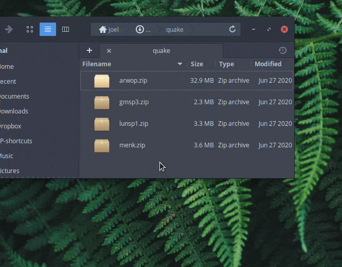
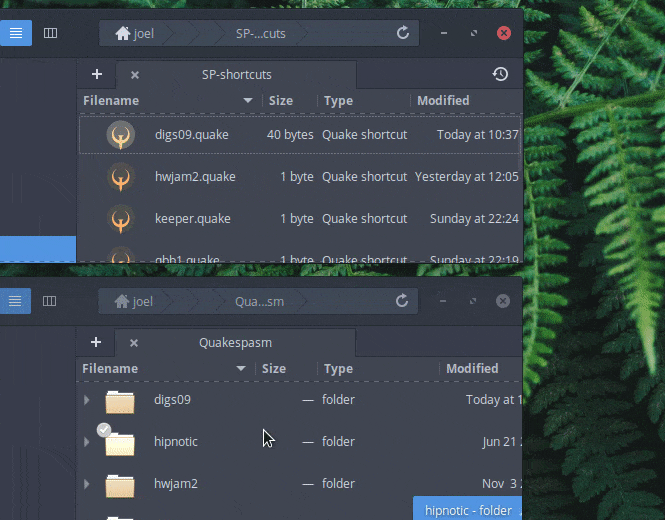

# What?

New custom Quake singleplayer releases appear pretty frequently on places like [func_msgboard](http://www.celephais.net/board/forum.php) and the Quake Mapping Discord server. It would be nice to have a low-friction way to swim in this river of content -- especially since many of the releases are collections of small maps, any time spent fiddling with files or in the Quake console seems like too much useless overhead.

This repo shares some ways that I've customized my singleplayer Quake setup on Linux to tackle that idea. The goal is to use desktop integration to quickly handle common stuff I do with Quake singleplayer releases: install, start play, resume play from savegame, hop between maps in a mapjam/speedmap pack, and uninstall.

<b>Automatically install and launch a downloaded zip of a Quake mod or maps</b> 

<b>Double-click shortcut to launch a gamedir and resume at most recent savegame</b> 

<b>Remove a shortcut and auto-delete the associated gamedir</b> 

<b>Optional Chrome browser integration</b> 

I currently use a variant of Ubuntu called elementary OS. So these files and commands should work on Ubuntu, elementary OS, or other Ubuntu variants. If not (or if they can also be tweaked to be compatible with other Linux flavors) then pull requests to improve them are welcome.

# Features

## Auto install+play of downloaded archives

Right-click on an archive (zip or rar or many other kinds) and select "Open with Quake". The archive's files will be installed into a gamedir in your Quake directory and organized so that the content is ready to play. Optionally a ".quake" shortcut (described below) will be created in a directory of your choice. Finally the gamedir will be automatically be launched in the process described below.

## Launching Quake to play a gamedir

Right-click on a gamedir in your Quake directory and select "Open with Quake".
* Common capitalization errors that break Linux play will be fixed.
* On first launch, optionally preview any readme/docs files in the gamedir, and preview/edit the config that will be used to launch Quake.
* If there are savegames, the gamedir will be activated in Quake and its most recent savegame loaded.
* If no savegames, the gamedir will be activated in Quake and its start map (or only map) will be loaded.

## Optional ".quake" shortcuts for launching gamedirs

Double-click on a ".quake" file to launch the related gamedir as above. E.g. double-clicking "zendar1d.quake" would have the same effect as right-clicking the "zendar1d" gamedir and choosing "Open with Quake".

## Launching Quake to play a specific bsp

Double-click on a bsp file (in some maps directory within a gamedir). The gamedir will be activated in Quake as above, with the difference that the selected bsp will be what is loaded as opposed to some startmap or savegame.

## Optional "mapjam helper"

For a smoother trip through a mapjam or speedmap pack: an in-game keybind to load the next map that you haven't played yet.

## Uninstalling a gamedir

Right-click on a gamedir and choose to open it with "Quake mod cleanup". The gamedir and any ".quake" shortcut to it will be deleted. Similarly you can do this on a ".quake" shortcut, to delete both the shortcut and the gamedir it points to. If your Quake engine makes use of a [userdata directory](scripts/userdata.md) then the gamedir subdirectory there will be removed as well.

(If you don't use ".quake" shortcuts or have a userdata directory then you don't care about this feature.)

## Optional Chrome browser integration

Right-click on a download link in a webpage and select "Open with Quake"; same features as described above for archive files.

# Caveats

## Installation is opinionated

I like to put any Quake map release into its own gamedir, even vanilla bsp-only releases that could just be dropped into id1/maps. So that's the arrangement that the main script here builds and works with. If you don't like to do things that way then there's probably not much here of interest.

> To evangelize briefly: Keeping each release in its own gamedir lets me see at a glance what I've currently installed, makes it obvious which savegames and bits of configuration are relevant to which releases, makes "uninstallation" braindead-simple, and also makes it possible to do some automated installation and launching with a pretty lightweight script.

One consequence is that non-standalone Arcane Dimensions and Copper releases installed this way cannot be launched *unless* you are using a Quake engine like [FTE](http://fte.triptohell.info/), [Quakespasm-Spiked](http://triptohell.info/moodles/qss/), [vkQuake](https://github.com/Novum/vkQuake), [Ironwail](https://github.com/andrei-drexler/ironwail), or [DarkPlaces](https://icculus.org/twilight/darkplaces/) that supports specifying multiple "game" directories to use when loading a mod or maps. See the "Arcane Dimensions and Copper" section of [scripts/README.md](scripts/README.md) for more details.

## Some assembly required

If you want to adopt these files to your own setup, you'll have to edit some files to set your options and paths, copy some files, and run some commands. There's no slick installer.

## Read the README for the content you want to play

The main script here is meant to deal with the common things that I would otherwise have to do manually over and over again when installing and running stuff. It handles any map release that I've tried it on so far, but it's not some complicated AI.

If installing a release correctly requires unusual steps like also downloading and merging additional patches, this script won't do that for you.

If running a release correctly requires unusual command-line arguments for Quake, this script won't do that for you.

If running a release correctly requires a base gamedir like Quoth or a missionpack, this script won't install that dependency for you if it's missing (but it should catch that error). Also, if the release requires a base gamedir that is *not* mentioned in a doc/readme included in the release, this script won't figure out that it needs that base.

Basically... be familiar with how the script works (described in [scripts/README.md](scripts/README.md)), check out the readme of whatever it is you want to install or run, and you'll see if there's special stuff you need to take care of manually. And when Quake is launched, check the console for errors that might indicate that different launch arguments are needed.

## This can't fix everything

One of the bullet points above was "Common capitalization errors that break Linux play will be fixed." The gist of this is that the script will fix problems related to common assumptions that the Quake engine makes about how things like directory names and file extensions are capitalized. So for example if there's a map named "FOO.BSP" the script will rename it to "FOO.bsp" so that it can be loaded properly in Linux.

Another available option (disabled by default) will create symlinks to make files available through other common filename variants -- in this example "FOO.bsp" would also be linked from "foo.bsp" and "Foo.bsp" -- just in case one of the files in the release is referring to something using incorrect capitalization.

What the script DOESN'T do is dig into the release files to really find what all the bad references are and specifically try to fix them. So for example if a map in some new episode you downloaded has an exit portal that leads to "mAP2" while the actual next map is in a loose bsp file named "map2.bsp", that won't work and even the auto-symlinks option described above won't fix it since it is not a common capitalization error.

Hopefully those sorts of truly weird capitalization errors will continue to be rare. You can detect them through paying attention to errors printed in the console when a map starts up or when something like that exit portal doesn't work. You can then figure out how to fix the problems yourself by manually renaming files/directories or creating symlinks, if it's worth fixing.

If you want to always 100% avoid such problems you'll need to use a Quake engine that is case-insensitive even on Linux. The only one I'm aware of at the moment is [FTE](http://fte.triptohell.info/).

# Installation/Uninstallation

## Main scripts

The first things to set up are the scripts that implement the behaviors mentioned in the Features section above. See [scripts/README.md](scripts/README.md).

## Desktop integration

Then you can hook up those behaviors to right-click and double-click actions in the desktop. See [desktop_integration/README.md](desktop_integration/README.md).

## Browser integration

It's certainly not required, but if you want to enable the "Open with Quake" behavior in Chrome then see [browser_integration/README.md](browser_integration/README.md).

# Reporting issues

Feel free to open a GitHub issue, or contact me in other ways if you are in a Discord channel with me etc. Things I would be interested in hearing about include:
* Straight-up bugs. I.e. it doesn't work for you on Ubuntu.
* Suggested ways to adapt the scripts and desktop integration to support other Linux flavors (or even UNIX, BSD, or macOS).
* Specific singleplayer releases that the script handles poorly, either in installation or launching.
